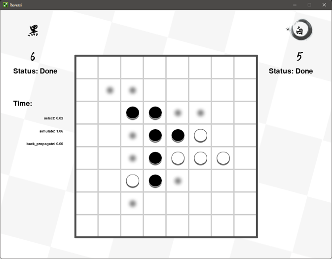
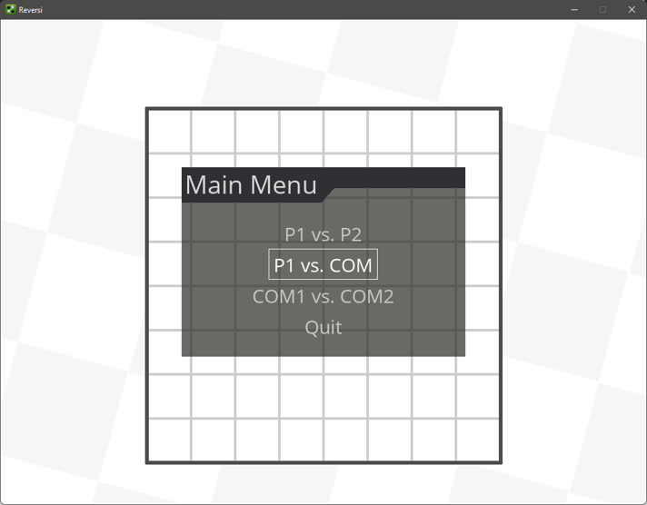
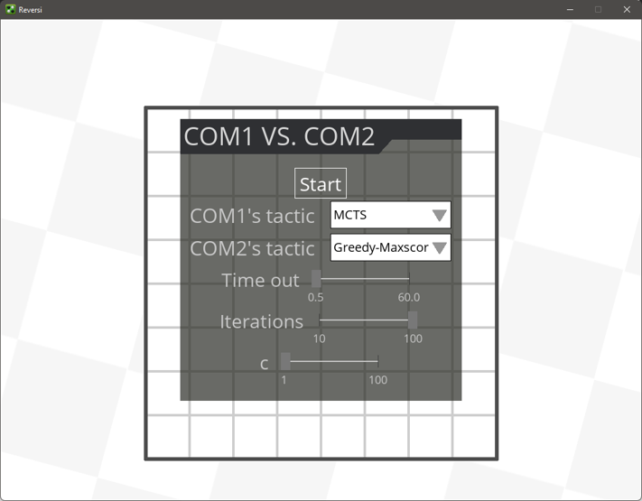
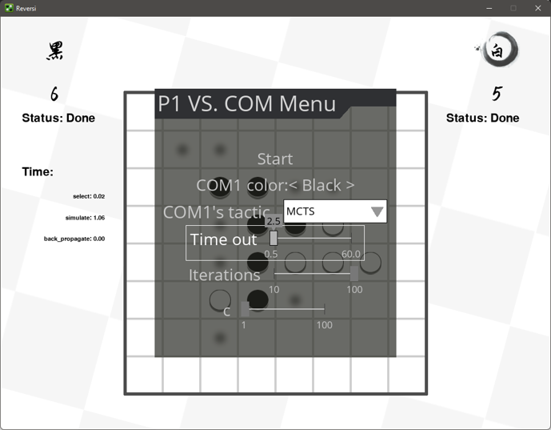
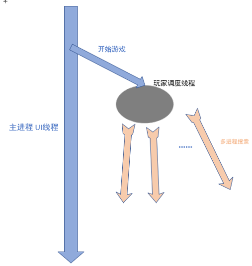
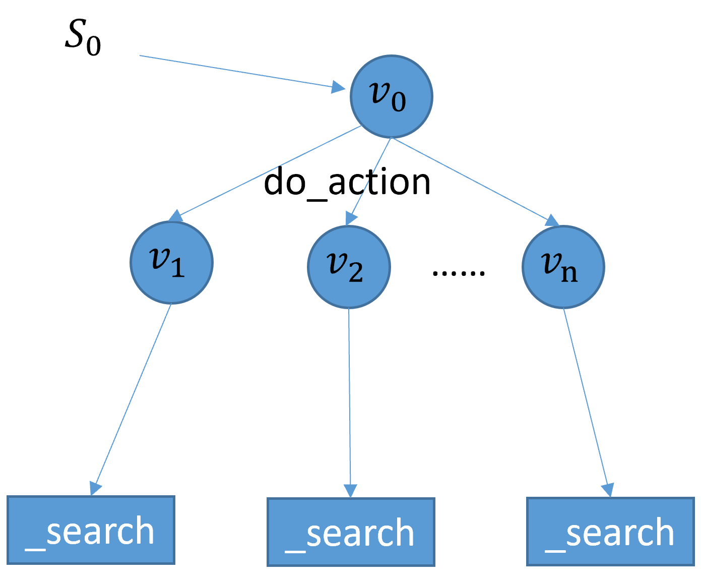
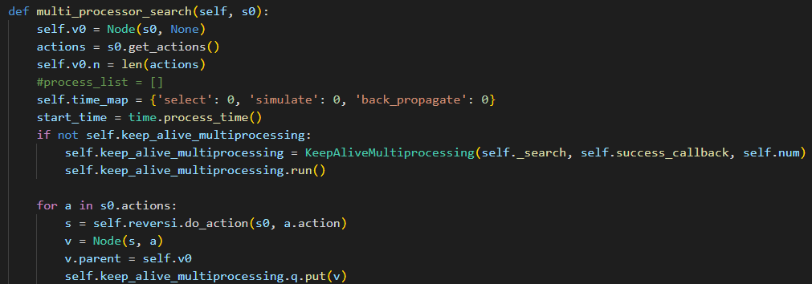

# black-white-chess-ai

这是一个黑白棋对弈程序

可以实现人机、人人、机机对弈

策略有
- MCTS，蒙特卡洛树搜索（主要）
- 贪心
- 专家系统

对弈界面

菜单

设置

运行中设置

可选模式：
- P1 vs. P2
- P1 vs. COM
- COM vs. COM   （用于对比不同策略、不同参数效果；生成对局数据）

COM的策略参数可以在开始前以及进行中修改

## COM策略
- MCTS
- 贪心-最大分
  - 下一步可翻转最多或得分最高
- 贪心-最少落子点
  - 下一步使对方落点位置最少（行动力）
- 专家系统
  - 稳定点优先，不同位置具有不同权重
  - 编写规则，对不同情况更新权重
- MCTS+深度评价网络（未成功）
  - UCB选择子节点时，价值函数加入评价网络的价值权重
  - 搜索时优先搜索价值高的代替随机
  

## 速度优化
### 并行优化

对于CPU密集型任务：
- Python多线程能否加速？
- 多进程创建销毁开销
- 多进程间通信

首先多线程保证计算和UI分离，计算中不会阻塞UI界面导致卡顿

调度线程中组织2名玩家轮流对局，一方没有落子点换另一位，2名都没落子点结束

需要MCTS时，在多进程中进行计算搜索然后返回结果执行

### 细节优化
- 计算有效落点时保存可翻转的点列表，避免仿真或执行时的重复计算
- 采用领域知识，对某些价值很高的位置直接处理，而不用进行搜索
